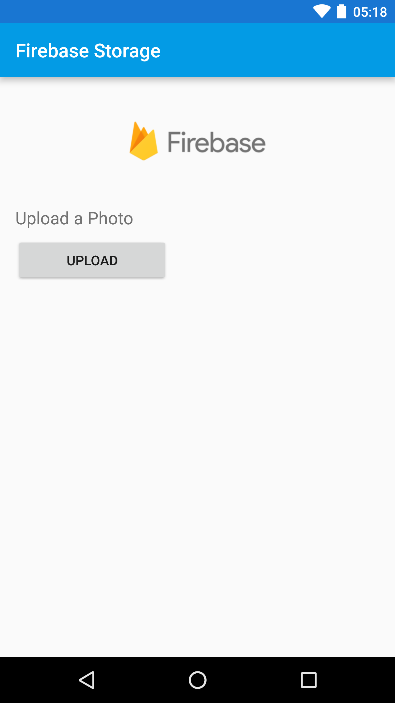

Cloud Storage for Firebase Quickstart
==============================

Original source: https://github.com/firebase/quickstart-android/tree/master/storage

To run this app you need to setup your own Firebase connection using goggle-services.json.

uses anonymus login

Note: I renamed the package to com.google.firebase.quickstart.database

in Firebase console use project FirebaseChatOwnDatabase

Rule used:

```plaintext
rules_version = '2';
service firebase.storage {
  match /b/{bucket}/o {
    match /{allPaths=**} {
      allow read, write: if true;
    }
  }
}
```

Introduction
------------

- [Read more about Cloud Storage for Firebase](https://firebase.google.com/docs/storage)

Getting Started
---------------

- [Add Firebase to your Android Project](https://firebase.google.com/docs/android/setup).
The package name you'll use is `com.google.firebase.quickstart.firebasestorage`.
- Run the Android application on your Android device or emulator. The app prompts you to
sign in, so make sure to [enable anonymous authentication](https://console.firebase.google.com/project/_/authentication/providers)
for your project.

Screenshots
-----------


Support
-------

https://firebase.google.com/support/

License
-------

Copyright 2018 Google, Inc.

Licensed to the Apache Software Foundation (ASF) under one or more contributor
license agreements.  See the NOTICE file distributed with this work for
additional information regarding copyright ownership.  The ASF licenses this
file to you under the Apache License, Version 2.0 (the "License"); you may not
use this file except in compliance with the License.  You may obtain a copy of
the License at

  http://www.apache.org/licenses/LICENSE-2.0

Unless required by applicable law or agreed to in writing, software
distributed under the License is distributed on an "AS IS" BASIS, WITHOUT
WARRANTIES OR CONDITIONS OF ANY KIND, either express or implied.  See the
License for the specific language governing permissions and limitations under
the License.
